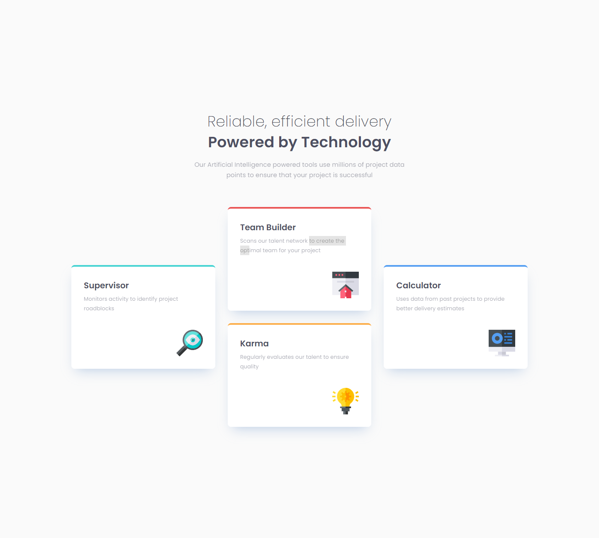
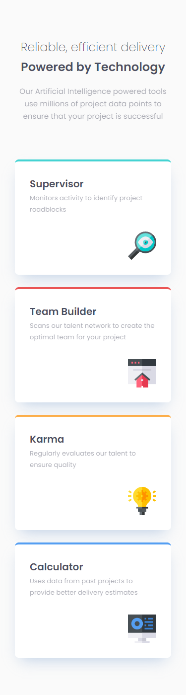

# Frontend Mentor - 4 card feature section solution

This is a solution to the [4 card feature section challenge on Frontend Mentor](https://www.frontendmentor.io/challenges/four-card-feature-section-weK1eFYK). Frontend Mentor challenges help you improve your coding skills by building realistic projects.

## Table of contents

- [Overview](#overview)
  - [The challenge](#the-challenge)
  - [Screenshot](#screenshot)
  - [Links](#links)
- [My process](#my-process)
  - [Built with](#built-with)
  - [What I learned](#what-i-learned)
- [Author](#author)

## Overview

### The challenge

Users should be able to:

- View the optimal layout for the site depending on their device's screen size

### Screenshot

### Links

<!-- - Solution URL: (https://www.frontendmentor.io/solutions/responsive-landing-page-with-grid-css-vars-cImP4dY0_) -->
<!-- - Live Site URL: (https://lm-meet-landing-page.netlify.app/) -->

## My process

### Built with

- Semantic HTML5 markup
- CSS custom properties/vars
- Desktop-first workflow

### What I learned

Not finished.

## Author

- Website - [Leon Michalak](https://www.leonmichalak.tech)
- Frontend Mentor - [@NinjaInShade](https://www.frontendmentor.io/profile/NinjaInShade)
- Instagram - [@lmdeveloper](https://www.instagram.com/lmdeveloper/)
